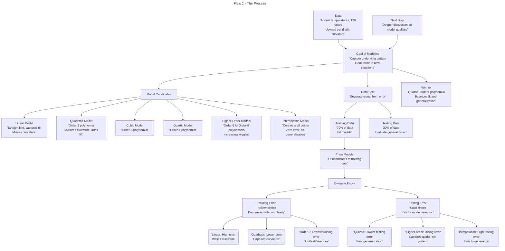

```mermaid
---
title: Flow 1 - The Process
---
    graph TD;
    A[Data<br>'Annual temperatures, 120 years<br>Upward trend with curvature'] --> B[Goal of Modeling<br>'Capture underlying pattern<br>Generalize to new situations'];
    B --> C[Model Candidates];
    C --> D[Linear Model<br>'Straight line, captures tilt<br>Misses curvature'];
    C --> E[Quadratic Model<br>'Order-2 polynomial<br>Captures curvature, adds lift'];
    C --> F[Cubic Model<br>'Order-3 polynomial'];
    C --> G[Quartic Model<br>'Order-4 polynomial'];
    C --> H[Higher-Order Models<br>'Order-5 to Order-8 polynomials<br>Increasing wiggles'];
    C --> I[Interpolation Model<br>'Connects all points<br>Zero error, no generalization'];
    B --> J[Data Split<br>'Separate signal from error'];
    J --> K[Training Data<br>'70% of data<br>Fit models'];
    J --> L[Testing Data<br>'30% of data<br>Evaluate generalization'];
    K --> M[Train Models<br>'Fit candidates to training data'];
    M --> N[Evaluate Errors];
    N --> O[Training Error<br>'Hollow circles<br>Decreases with complexity'];
    N --> P[Testing Error<br>'Solid circles<br>Key for model selection'];
    O --> Q('Linear: High error<br>Misses curvature');
    O --> R('Quadratic: Lower error<br>Captures curvature');
    O --> S('Order-5: Lowest training error<br>Subtle differences');
    P --> T('Quartic: Lowest testing error<br>Best generalization');
    P --> U('Higher-order: Rising error<br>Captures quirks, not pattern');
    P --> V('Interpolation: High testing error<br>Fails to generalize');
    B --> W[Winner<br>'Quartic -Order4 polynomial<br>Balances fit and generalization'];
    X[Next Step<br>'Deeper discussion on model qualities'] --> B;
```
