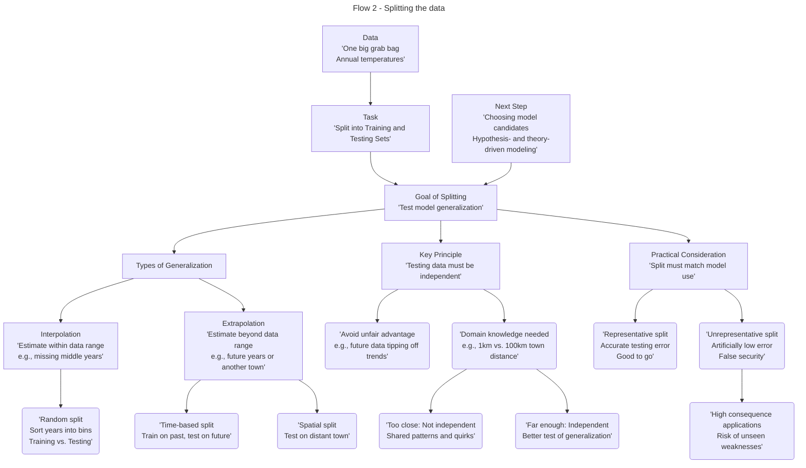

```mermaid
---
title: Flow 2 - Splitting the data
---
    graph TD;
    A[Data<br>'One big grab bag<br>Annual temperatures'] --> B[Task<br>'Split into Training and Testing Sets'];
    B --> C[Goal of Splitting<br>'Test model generalization'];
    C --> D[Types of Generalization];
    D --> E[Interpolation<br>'Estimate within data range<br>e.g., missing middle years'];
    E --> F('Random split<br>Sort years into bins<br>Training vs. Testing');
    D --> G[Extrapolation<br>'Estimate beyond data range<br>e.g., future years or another town'];
    G --> H('Time-based split<br>Train on past, test on future');
    G --> I('Spatial split<br>Test on distant town');
    C --> J[Key Principle<br>'Testing data must be independent']
    J --> K('Avoid unfair advantage<br>e.g., future data tipping off trends');
    J --> L('Domain knowledge needed<br>e.g., 1km vs. 100km town distance');
    L --> M('Too close: Not independent<br>Shared patterns and quirks');
    L --> N('Far enough: Independent<br>Better test of generalization');
    C --> O[Practical Consideration<br>'Split must match model use'];
    O --> P('Representative split<br>Accurate testing error<br>Good to go');
    O --> Q('Unrepresentative split<br>Artificially low error<br>False security');
    Q --> R('High consequence applications<br>Risk of unseen weaknesses');
    S[Next Step<br>'Choosing model candidates<br>Hypothesis- and theory-driven modeling'] --> C;
```
