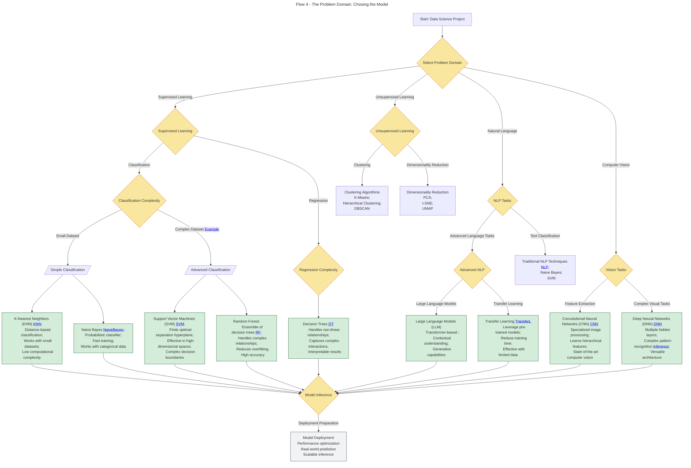

```mermaid
---
title: 'Flow 4 - The Problem Domain: Chosing the Model'
---
        flowchart TD;
	    start[Start: Data Science Project] --> problem_type{Select Problem Domain};
        %% click start href "https://www.github.com" "This is a link" _blank
	    %% Problem Type Branching;
	    problem_type -->|Supervised Learning| supervised{Supervised Learning};
	    problem_type -->|Unsupervised Learning| unsupervised{Unsupervised Learning};
	    problem_type -->|Natural Language| nlp_domain{NLP Tasks};
	    problem_type -->|Computer Vision| vision_domain{Vision Tasks};
        
         
	    %% Supervised Learning Paths;
	    supervised -->|Classification| classification{Classification Complexity};
	    supervised -->|Regression| regression{Regression Complexity};
        click supervised call callback() "Tooltip for a callback"
	    
	    %% Classification Algorithms;
	    classification -->|Small Dataset| simple_classification[/Simple Classification/];
	    classification -->|Complex Dataset <a href='https://notebooks.githubusercontent.com/view/ipynb?&commit=7cc9d6d968c92a16a792e052658cfbc72065777b&device=unknown_device&docs_host=https%3A%2F%2Fdocs.github.com&enc_url=68747470733a2f2f7261772e67697468756275736572636f6e74656e742e636f6d2f754f74746177612d49542d52657365617263682d7465616368696e672f53564d2f376363396436643936386339326131366137393265303532363538636662633732303635373737622f6e6f7465626f6f6b732f4d4c54535f32303234303533305f53564d5f4e6f7465626f6f6b334265796f6e644c696e6561724879706572706c616e655f454e5f312e302e6970796e62&logged_in=false&nwo=uOttawa-IT-Research-teaching%2FSVM&path=notebooks%2FMLTS_20240530_SVM_Notebook3BeyondLinearHyperplane_EN_1.0.ipynb&platform=windows&repository_id=696287816&repository_type=Repository&version=128#Visualizing-Non-linear-classification'>Example</a>| advanced_classification[/Advanced Classification/];
	    
	    simple_classification --> KNN["K-Nearest Neighbors (KNN) <a href='https://github.com/uOttawa-IT-Research-teaching/ML_k-nearest-neightbours/blob/main/notebooks/MLTS_20241205_KNN_K-nearest%20neighbours_EN_1.0.ipynb'>KNN</a>;
	    Distance-based classification;
	    Works with small datasets;
	    Low computational complexity"];
	    
	    simple_classification --> NaiveBayes["Naive Bayes <a href='https://github.com/uOttawa-IT-Research-teaching/ML_naive_bayes/blob/main/notebooks/MLTS_20240530_NB_BayesTrainingNotebook_EN_1.0.ipynb'>NaiveBayes</a>;;
	    Probabilistic classifier;
	    Fast training;
	    Works with categorical data"];
	    
	    advanced_classification --> SVM["Support Vector Machines (SVM) <a href='https://github.com/uOttawa-IT-Research-teaching/SVM/blob/main/notebooks/MLTS_20240530_SVM_Notebook1Regularization_EN_1.0.ipynb'>SVM</a>;
	    Finds optimal separation hyperplane;
	    Effective in high-dimensional spaces;
	    Complex decision boundaries"];

            
	    advanced_classification --> RandomForest["Random Forest;
	    Ensemble of decision trees <a href='https://github.com/uOttawa-IT-Research-teaching/DecisionTrees/blob/main/notebooks/MLTS_20240530_DTRF_Notebook2RandomForest_EN_1.0.ipynb'>RF</a>;
	    Handles complex relationships;
	    Reduces overfitting;
	    High accuracy"];
         	    
	    %% Regression Paths;
	    regression --> DecisionTrees["Decision Trees <a href='https://github.com/uOttawa-IT-Research-teaching/DecisionTrees/blob/main/notebooks/MLTS_20240530_DTRF_Notebook1DecisionTree_EN_1.0.ipynb'>DT</a>;
	    Handles non-linear relationships;
	    Captures complex interactions;
	    Interpretable results"];
	    
	    %% NLP Domain;
	    nlp_domain -->|Text Classification| nlp_classification["Traditional NLP Techniques <a href='https://github.com/uOttawa-IT-Research-teaching/ML_Natural_Language_Processing/blob/main/notebooks/01-Sentiment%20Analysis.ipynb'>NLP</a>;
	    Naive Bayes;
	    SVM"];
	    
	    nlp_domain -->|Advanced Language Tasks| advanced_nlp{Advanced NLP};
	    
	    advanced_nlp -->|Large Language Models| LLM["Large Language Models (LLM)
	    Transformer-based ;
	    Contextual understanding;
	    Generative capabilities"];
	    
	    advanced_nlp -->|Transfer Learning| TransferLearning["Transfer Learning <a href='https://github.com/uOttawa-IT-Research-teaching/TransferLearning_CNN/blob/main/notebooks/2%20-%20transferLearningCNN.ipynb'>TransferL</a>
	    Leverage pre-trained models;
	    Reduce training time;
	    Effective with limited data"];
	    
	    %% Computer Vision;
	    vision_domain -->|Feature Extraction| CNN["Convolutional Neural Networks (CNN) <a href='https://github.com/uOttawa-IT-Research-teaching/TransferLearning_CNN/blob/main/notebooks/1%20-%20CNN_Concepts.ipynb'>CNN</a>
	    Specialized image processing;
	    Learns hierarchical features;
	    State-of-the-art computer vision"];
	    
	    vision_domain -->|Complex Visual Tasks| DNN["Deep Neural Networks (DNN) <a href='https://github.com/uOttawa-IT-Research-teaching/DNN-CNN_Intro/blob/main/2%20-%20DNN_PyTorch.ipynb'>DNN</a>
	    Multiple hidden layers;
	    Complex pattern recognition <a href='https://github.com/uOttawa-IT-Research-teaching/DeepLearning_CNN/blob/main/2%20-%20Inference.ipynb'>Inference</a>;
	    Versatile architecture"];
	    
	    %% Unsupervised Learning;
	    unsupervised -->|Clustering| clustering["Clustering Algorithms
	    K-Means;
	    Hierarchical Clustering;
	    DBSCAN"];
	    
	    unsupervised -->|Dimensionality Reduction| dim_reduction["Dimensionality Reduction
	    PCA;
        t-SNE;
	    UMAP"];
	    
	    %% Model Inference and Deployment;
	    KNN & NaiveBayes & SVM & RandomForest & DecisionTrees &  LLM & TransferLearning & CNN & DNN --> inference{Model Inference};
	    inference -->|Deployment Preparation| ModelDeployment["Model Deployment
	    Performance optimization
	    Real-world prediction
	    Scalable inference"];
	    
	    %% Styling
	    classDef decision fill:#f9e79f,stroke:#d35400;
	    classDef algorithm fill:#d4edda,stroke:#155724;
	    classDef deployment fill:#f2f3f4,stroke:#2c3e50;
	    class problem_type,supervised,unsupervised,nlp_domain,vision_domain,classification,regression,advanced_nlp,inference decision;
	    class KNN,NaiveBayes,SVM,RandomForest,DecisionTrees,LLM,TransferLearning,CNN,DNN algorithm;
	    class ModelDeployment deployment;
```
